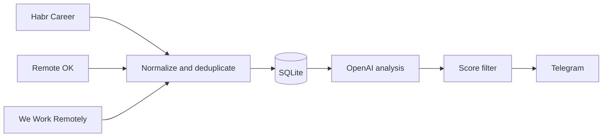

# AI Career Agent

AI Career Agent is a self-hosted Python service that continuously collects job
opportunities, normalizes them, scores them against an owner-defined profile,
and sends only suitable results to Telegram.

The application is designed for a single owner per installation. API keys,
Telegram details, the candidate profile, logs, and the SQLite database remain
outside the repository.

## Current Version

Version `0.3` is a production-oriented rewrite of the original n8n prototype.
The prototype remains available in Git history and under the
`v0.1-n8n-prototype` tag.

See [Project evolution](docs/PROJECT_EVOLUTION.md) for the architectural changes.

## Features

- Habr Career RSS, Remote OK API, and We Work Remotely RSS providers
- one normalized `Opportunity` model for every source
- persistent deduplication in SQLite
- structured OpenAI analysis against a Telegram-managed candidate profile
- score-based Telegram delivery with retry-safe notification history
- independent enable flags and polling intervals for each provider
- provider isolation: one failed source does not stop the remaining pipeline
- rotating logs, service heartbeats, health checks, and Docker deployment
- 76 automated tests

## Processing Flow



The worker wakes up on a common schedule, while SQLite stores the independent
polling state for each provider. Restarting the process does not reset that
state or trigger unnecessary source requests.

## Requirements

- Docker with Docker Compose, or Python 3.12+
- an OpenAI API key
- a Telegram bot token and private chat ID

Each installation must use credentials owned by its operator. Do not reuse
credentials from another installation.

## Quick Start with Docker

1. Clone the repository and enter its directory.
2. Create the local configuration:

   ```bash
   cp .env.example .env
   ```

3. Fill in at least:

   ```text
   OPENAI_API_KEY=
   OPENAI_MODEL=
   TELEGRAM_TOKEN=
   TELEGRAM_CHAT_ID=
   CHECK_INTERVAL_SECONDS=300
   MIN_AI_SCORE=70
   ```

4. Build and start both services:

   ```bash
   docker compose up -d --build
   docker compose ps
   ```

5. Send `/start` to the configured Telegram bot and complete the profile form.

6. Inspect service logs when needed:

   ```bash
   docker compose logs --tail 100 worker profile-bot
   ```

The worker runs the full collection, analysis, and delivery cycle. The
profile-bot handles `/start`, `/profile`, `/edit_profile`, and `/skills`.

## Provider Configuration

All three providers are enabled by default:

```text
HABR_ENABLED=true
HABR_POLL_INTERVAL_SECONDS=300
REMOTEOK_ENABLED=true
REMOTEOK_POLL_INTERVAL_SECONDS=900
WWR_ENABLED=true
WWR_POLL_INTERVAL_SECONDS=900
```

Provider intervals cannot be lower than 60 seconds. A provider can be disabled
without modifying Python code.

## Local Development

```bash
python -m venv .venv
source .venv/bin/activate
pip install -r requirements.txt
cp .env.example .env
python -m unittest discover -s tests
python worker.py --once
```

On Windows, activate the virtual environment with
`.venv\Scripts\Activate.ps1`.

## Data and Security

The following files must never be committed:

- `.env` and other local environment files
- SQLite databases and WAL files
- the completed candidate profile
- logs, deployment archives, and backups
- API keys, Telegram tokens, and chat identifiers

The supplied `.env.example` and profile example contain placeholders only.
Review [DEPLOYMENT.md](DEPLOYMENT.md) before a VPS deployment.

## Repository Layout

```text
models/       Domain models
providers/    Source integrations
services/     AI, Telegram, scheduling, and pipeline logic
storage/      SQLite repository and persistent state
profiles/     Non-personal profile example
tests/        Automated test suite
scripts/      Deployment helper
```

## Scope

This release does not perform automatic job applications. Telegram channels,
Kwork, Workzilla, and unofficial scraping are intentionally excluded. New
providers should use an official API or feed and implement the common provider
contract.

## License

MIT. See [LICENSE](LICENSE).
