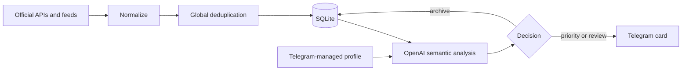

# AI Career Agent / JobMonitor

Self-hosted Python service that continuously discovers job opportunities, removes duplicates, evaluates each listing against user-defined career directions with OpenAI, and sends concise recommendations to Telegram.

This repository documents the full product evolution: the original n8n prototype is preserved under the `v0.1-n8n-prototype` tag, while the current V1 is an independent Python application designed for continuous Docker deployment.

## What It Demonstrates

- product design around a real job-search workflow;
- modular integrations with official APIs, RSS feeds, and public job-board endpoints;
- typed normalization into a shared opportunity model;
- semantic AI matching against multiple user-created search directions;
- persistent global deduplication across sources;
- retry-safe Telegram delivery and profile onboarding;
- independent provider schedules and fault isolation;
- SQLite migrations, health checks, operational logging, and short-retention backups;
- privacy-aware configuration with credentials and user data kept outside Git.

## Current V1

The production runtime integrates:

- Habr Career;
- Remote OK;
- We Work Remotely;
- Remotive;
- Jobicy;
- Работа России;
- selected Greenhouse job boards, each treated as an independent source.

The Telegram bot lets the user create common preferences and one or more free-text search directions. A direction can describe a profession, project type, skills, experience, preferred tasks, geography, and work format. The AI compares every opportunity with all enabled directions and returns one decision:

- `priority` — strong, evidence-based match;
- `review` — plausible or adjacent opportunity worth checking;
- `archive` — no meaningful match or a hard exclusion.

## Processing Flow



Each provider has its own enable flag, polling interval, persistent run state, and error boundary. A failure or rate limit in one provider does not stop the others.

## Telegram Result

A recommendation card contains only decision-ready information:

- match percentage and selected search direction;
- title, company, employment type, work format, and location;
- salary when the source provides it;
- concise reasons, risks, and required application actions;
- an editable response draft;
- source, publication date, and direct vacancy link.

## Reliability

- SQLite remembers processed listings and prevents repeat notifications.
- Notification state makes Telegram delivery retry-safe.
- Interrupted runs and AI claims are recovered after restart.
- OpenAI input/output token usage is stored for operational cost analysis.
- Docker health checks cover the worker and profile bot.
- Automated tests cover providers, normalization, deduplication, storage, AI contracts, profile flows, scheduling, and delivery.

Current verification: **140 automated tests**.

## Quick Start

Requirements: Docker Compose, an OpenAI API key, and a Telegram bot token.

```bash
git clone https://github.com/rinatshaidi/ai-career-agent.git
cd ai-career-agent
cp .env.example .env
docker compose up -d --build
docker compose ps
```

Fill `.env` with credentials owned by the installation operator. Then send `/start` to the bot and complete the profile questionnaire.

For local development:

```bash
python -m venv .venv
source .venv/bin/activate
pip install -r requirements.txt
python -m unittest discover -s tests
```

On Windows, activate the environment with `.venv\Scripts\Activate.ps1`.

## Privacy And Security

The repository contains no production credentials or completed user profile. Every installation supplies its own:

- `.env` values;
- OpenAI and Telegram credentials;
- SQLite database;
- profile answers;
- logs and backups.

The `.gitignore` excludes these files. The provided configuration and profile files contain placeholders only.

## Repository Layout

```text
models/       Typed domain and AI result models
providers/    Independent source integrations
services/     Pipeline, AI, Telegram, scheduling, and profile flows
storage/      SQLite schema, migrations, state, and deduplication
scripts/      Deployment, smoke-test, audit, and backup helpers
profiles/     Non-personal profile example
tests/        Automated test suite
docs/         Project evolution and supporting documentation
```

See [SPECIFICATION.md](SPECIFICATION.md) for product requirements, [DEPLOYMENT.md](DEPLOYMENT.md) for operations, and [Project evolution](docs/PROJECT_EVOLUTION.md) for the n8n-to-Python transition.

## Scope

V1 finds and evaluates opportunities; it does not apply automatically. Closed platforms and unofficial scraping are intentionally excluded until a stable and permitted integration method exists.

## License

MIT. See [LICENSE](LICENSE).
